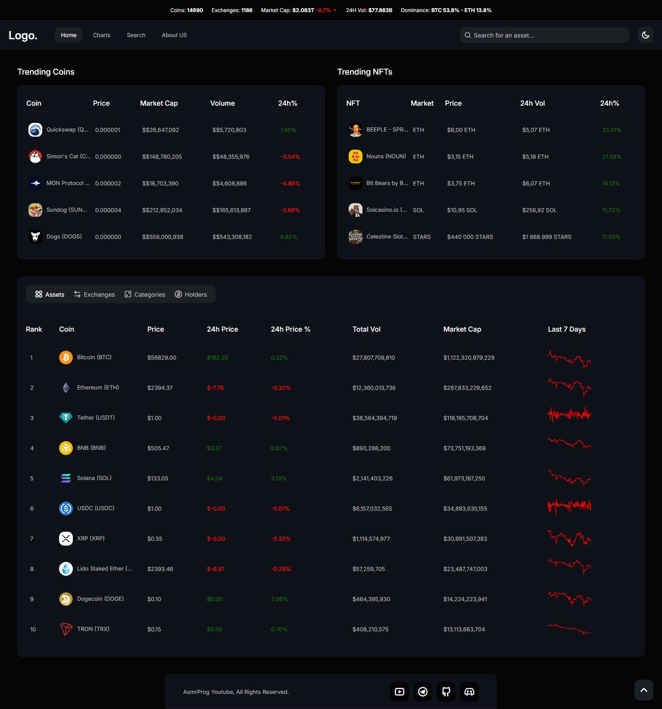
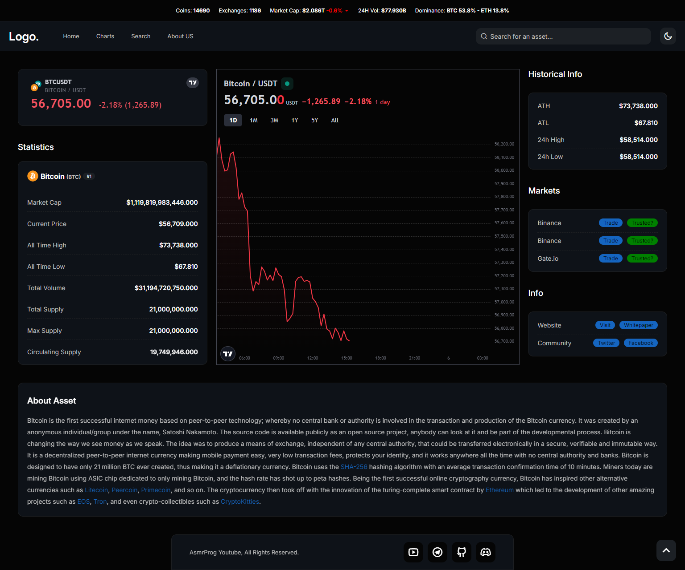
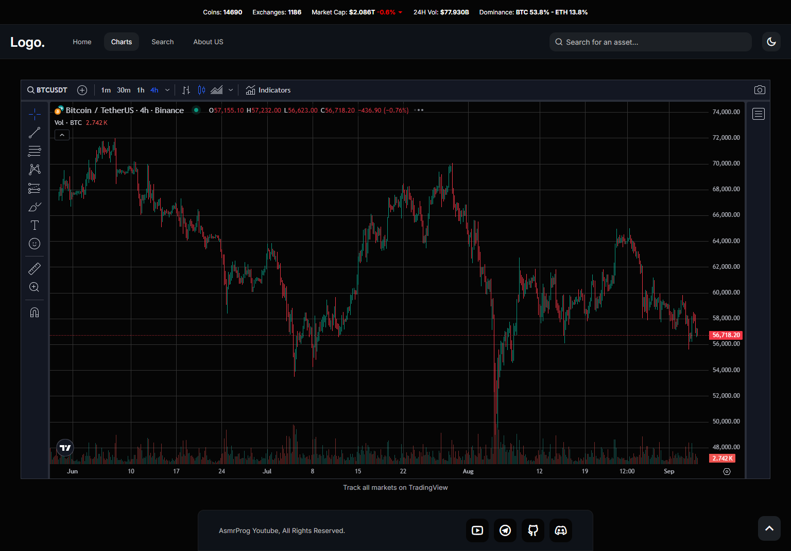
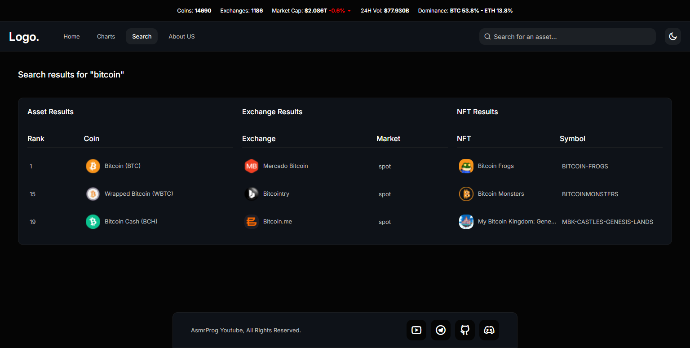
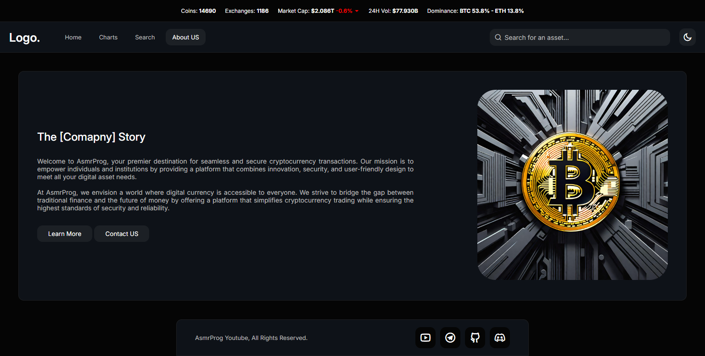
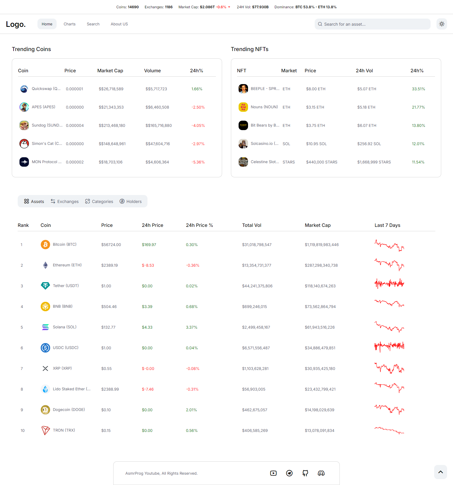
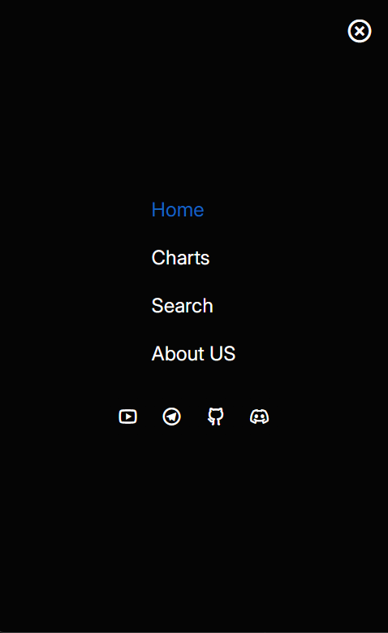

# Fullstack Crypto Marketplace

🖥️ Ready to build a full stack crypto marketplace from scratch? Join us in this exciting tutorial where we create a feature-rich crypto marketplace using Vanilla JavaScript! 🚀✨ Perfect for developers looking to enhance their full stack skills and build a dynamic web application. 
Throughout this video, we will guide you step-by-step through the process of building a full-stack web application using vanilla javascript.😉
([Open Video in Youtube](https://youtu.be/LlhTafcDCuU))

Features of final project:

- Live Data Fetching: Get real-time updates with free and fixed limits 📈
- Theme Options: Toggle between Dark and Light themes 🌑🌞
- Trending Coins & NFTs: Stay up-to-date with the hottest assets 🚀
- Top Coins Overview: See key coins with a sparkline chart 📊
- Top Exchanges: Explore comprehensive info about leading exchanges 🏦
- Top Categories: Navigate through various categories easily 🗂️
- BTC Holder Companies: Discover companies holding Bitcoin 🏢
- Detailed Coin Info: Click on any coin to view full details 🔎
- Search Functionality: Find coins, exchanges, and NFTs quickly 🔍
- TradingView Integration: Enjoy live charts, tickers, and historical data 📅
- Full Responsiveness: Works seamlessly on any device 📱💻, with a menu for smaller screens 📲

This Video Benefits:

- Beginner-Friendly: Designed for those just starting with JavaScript, this mini-course will guide you through creating a real-world project. 📘
- Portfolio Boost: Add a dynamic and impressive project to your portfolio to showcase your skills. 💼

Don't miss out on these expert insights and practical tips to make your crypto marketplace stand out! Watch now and start creating! 🌟

# Screenshot
Here we have project screenshot :

### Main Page

### Coin Page

### Charts Page

### Search Page

### About Page

### Light Mode (For All Pages)

## Also Mobile Menu
